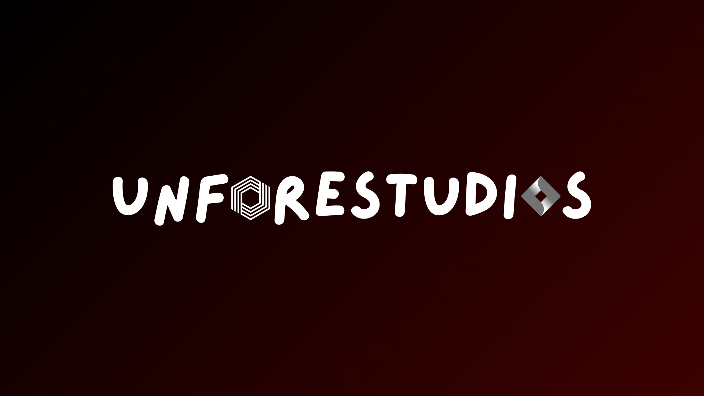
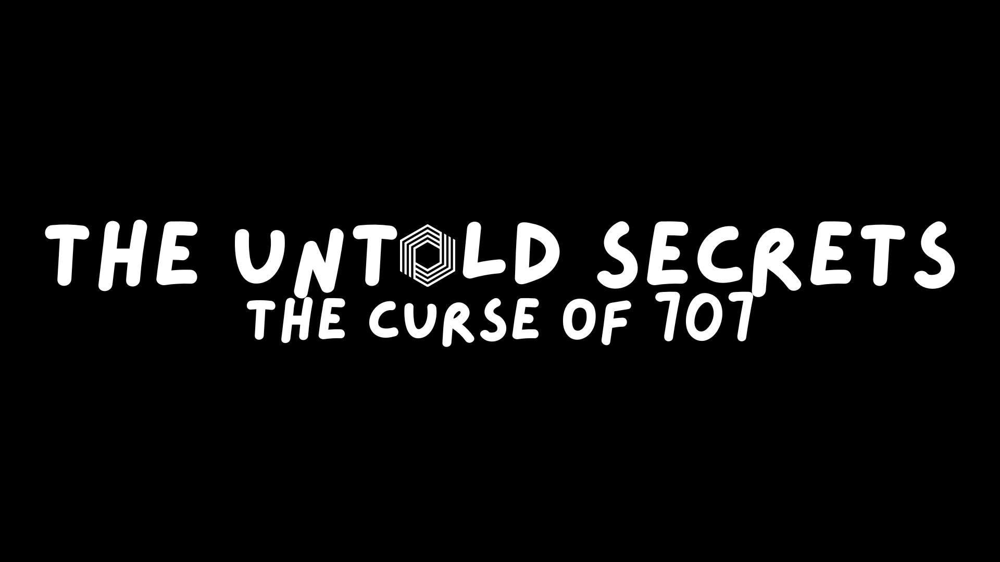

# UnforeStudios

A small indie development group.
**Here about UnforeSpace? Click [here](#unforespace)**

Founded in 2023, we are a group of developers from Australia and America.

We have many games, these include:

  
The Untold Secrets

  
  W.I.P

  
Nexus

  
  A multi-function discord bot.

  
CameraSysRblx

  A discontinued project from 2024.
  Found on Roblox Marketplace: [LINK DISPLACED]

  
Here about UnforeSpace?

  
  
  UnforeSpace was made by a few developers of the group and used the official unforetold.space URL. We do not maintain control of this anymore. UnforeStudios is primarily operating out of the unforestudios.com domain now. 
  **UnforeSpace was not, and is not managed internally from UnforeStudios, nor by the owner of UnforeStudios anymore.**

  The developers working on UnforeSpace decided they had enough, and in a response we discontinued the service. 
  **All services below are now EOL.**
  - UnforeSpace (25/05/2025)
  - UnforeTek (20/05/2025)
  - UnforeEagler (20/05/2025)

  Any copies from 25/05/2025 onwards seen on the web are not owned/controled/maintained by UnforeStudios.
  We accept no responsibility for any actions of the users that used it as stated in the [Terms Of Service](https://docs.google.com/document/d/119k7J_vTonnZQlM0d7tgnCSyLkpqTkVfQLEHQOjR9Gg/edit?usp=sharing), which all users who set a username automatically agreed to as stated.
  **Please note that the terms of service stated above are no longer valid, as they have been depricated in favor of the new [Terms of Service](https://www.unforestudios.com/tos)**

<!--

**Here are some ideas to get you started:**

🙋‍♀️ A short introduction - what is your organization all about?
🌈 Contribution guidelines - how can the community get involved?
👩‍💻 Useful resources - where can the community find your docs? Is there anything else the community should know?
🍿 Fun facts - what does your team eat for breakfast?
🧙 Remember, you can do mighty things with the power of [Markdown](https://docs.github.com/github/writing-on-github/getting-started-with-writing-and-formatting-on-github/basic-writing-and-formatting-syntax)
-->
